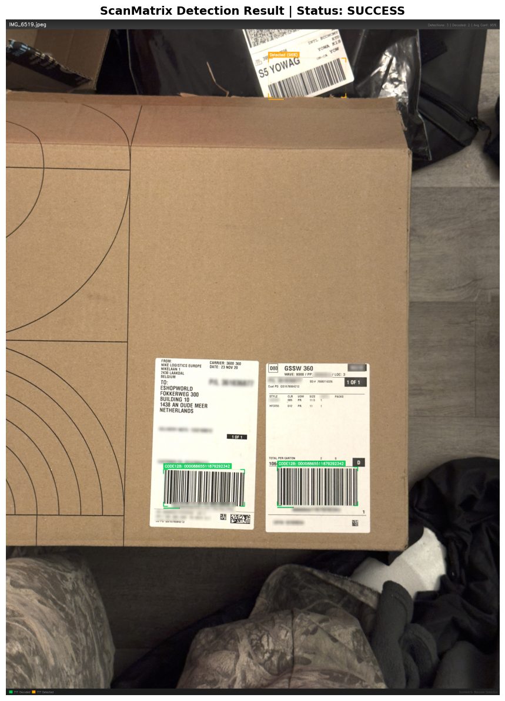

# **ScanMatrix**  

IMPORTANT NOTE: MAIN BRANCH FOR THE MOBILE APPLICATION IS mobile-app

## **Group 22**

### **Team Members and Their Roles**

- **Reyaan Trimizi (Scrum Master, Machine Learning Engineer)**
    - Responsible for leading the project, integrating machine learning models, and optimizing performance.
- **Brevin Baskaran (Computer Vision Specialist)**
    - Focus on developing and implementing computer vision techniques.
- **Nicholas Yeung (Machine Learning Engineer 2)**
    - Works on the integration of barcode decoding libraries and backend systems.
- **Jessica Guo (Software Engineer)**
    - focusing on user interface and optimizing performance
- **Kyro Nassif (Software Engineer)**
    - Working on training and integrating machine learning models

---

## **1. Project Overview**  
ScanMatrix is a cutting-edge barcode scanning system that leverages advanced image processing and machine learning algorithms to efficiently and accurately scan and decode various types of barcodes. This project focuses on building an intelligent barcode scanning solution to improve logistics and warehouse operations. The system will leverage advanced computer vision techniques to detect and decode barcodes in real-time under various conditions, such as inconsistent lighting and angled surfaces. By streamlining inventory management processes and reducing errors in barcode recognition, the project addresses critical challenges in modern logistics workflows. The system will utilize state-of-the-art models such as YOLOv8 for object detection and decoding libraries like Zxing, ensuring robust performance and seamless integration with existing systems.

---

## **2. Customer Details**
- **Name**: Asim Darweish 
- **Affiliation**: PackageX
- **Email**: asim@packagex.io

---
### **3. Objectives**

### **Benefits to the Customer**

- **Better Barcode Management**: Simplifies inventory processes with fast and accurate barcode scanning.
- **Fewer Errors**: Cuts down on mistakes in barcode recognition, making operations smoother and reducing delays.
- **Works Anywhere**: Handles tricky conditions like bad lighting, damaged labels, or angled surfaces without a problem.
- **More Efficient Logistics**: Speeds up workflows by cutting out the need for manual barcode entry, saving both time and effort.

### **Key Things to Accomplish**

- **Highly Accurate Barcode Scanning**: Make sure the system detects and decodes barcodes accurately, no matter the conditions.
- **Easy Integration**: Ensure it works seamlessly with the customer’s existing systems to make the transition smooth.
- **Support for All Barcode Types**: Handle everything from traditional barcodes (UPC, EAN) to 2D codes like QR codes and Data Matrix.
- **Handles Problems Gracefully**: Create solutions for damaged or incomplete barcodes to keep things running smoothly.

### **Criteria for Success**

- **Top-Notch Accuracy**: Hit a minimum of **80% accuracy** in detecting and decoding barcodes to ensure trustworthiness.
- **Fast and Real-Time**: Keep processing times under **1 second per scan** for quick, real-time performance.
- **Simple to Set Up**: Make integration with other systems easy and hassle-free for the customer.
- **Room to Grow**: Design the system to adapt to new barcode formats or features as needs change.

---

### **4. Expected/Anticipated Architecture**

- **Input**: Barcode images captured via camera (through a phone application) or uploaded by users.
- **Processing**:
    - **YOLOv8** for real-time object detection and localization of barcodes.
    - **Zxing Library** is used to decode various barcode types (QR codes, UPC, EAN, etc.)
- **Output**: Decoded barcode information displayed in the UI or sent to integrated systems.
- **Infrastructure**:
    - Backend built on Python with Flask or FastAPI.
    - Supabase used for authentication, database management, and edge functions. 
    - Frontend with React.js for a responsive web interface.
    - Dockerized deployment for cross-platform compatibility.

---

### **5. Anticipated Risks**

### **Engineering Challenges**

- Maintaining real-time performance under resource-constrained environments.
- Ensuring accuracy in challenging conditions like poor lighting or damaged barcodes.
- Compatibility issues with diverse barcode formats and third-party systems.

### **Mitigation Strategies**

- Leveraging pre-trained models and fine-tuning them for specific conditions.
- Implementing adaptive brightness and contrast adjustments to preprocess images.
- Rigorous testing across different environments and barcode types.

### **Anticipated ML Risks**

- High GPU resource requirements for training and running ML models.
- Large datasets are challenging to store, transfer, and manage.
- Poor image quality, blurry barcodes, or unusual angles may reduce detection accuracy.
- Deployment costs for GPU-backed backend can be high.
- Integration complexity between frontend, backend, and Supabase services (authentication, database, edge functions).
- Limited user accessibility due to GPU requirements for running the backend locally.


**Legal and Social Issues**

- **Protecting Privacy**
    - Follow rules like GDPR and CCPA to keep any barcode data safe.
    - Use encryption to make sure information stays secure during storage and sharing.
- **Licensing and Patents**
    - Ensure we have the right permissions to use tools like YOLOv8 and Zxing and double-check existing patents to avoid any legal issues.
- **Making It Accessible**
    - Design the system so it's simple and accessible, even for non-technical users.
    - Include features like high-contrast modes or voice support to help a wider range of users.
- **Following the Rules**
    - Stick to industry standards for barcodes, like ISO codes for UPCs and QR codes, to ensure compatibility.
- **Impact on People and the Planet**
    - Reduce errors to cut down on waste and make logistics more sustainable.

---
## **Wiki page**
- **Link**: [https://balsam-bobolink-b75.notion.site/ScanMatrix-Barcode-Scanning-System-18337bb1b02680779903f5ac8ba93992](https://www.notion.so/Summary-Page-1c737bb1b026803c8cfdd977f713987c)


## **6. Sample Results**

The `results/` folder contains a few sample outputs from the pipeline showing:
- Successful barcode detections with green bounding boxes
- Decoded barcode data overlaid on images
- Examples at various distances and lighting conditions

### Example Output


*Green boxes indicate successfully decoded barcodes. Yellow Boxes indicate detected but not decoded.*

---

## **7. Files**

| File | Description |
|------|-------------|
| `ScanMatrix.ipynb` | Main notebook with detection and decoding pipeline |
| `README.md` | Project documentation |
| `results/` | Sample output images from pipeline runs |

---

## **8. Quick Start**

### **Reproducible Dataset Generation**

Generate the synthetic YOLO dataset from the repository root:

```bash
python scripts/generate_dataset.py --seed 42
```

The generator now:

- uses repository-relative paths instead of machine-specific absolute paths
- records the random seed and barcode payload for every generated sample
- writes `data/dataset_manifest.json` for traceability
- supports `--dry-run` to inspect the planned dataset split without generating image files

Example dry run:

```bash
python scripts/generate_dataset.py --train-count 5 --val-count 2 --seed 7 --dry-run
```

### **Notebook Workflow**

1. Open `ScanMatrix.ipynb` in Google Colab
2. Update `MODEL_PATH` and `IMAGE_PATH` in the Configuration cell
3. Run all cells
4. View annotated output image with detection results

---
